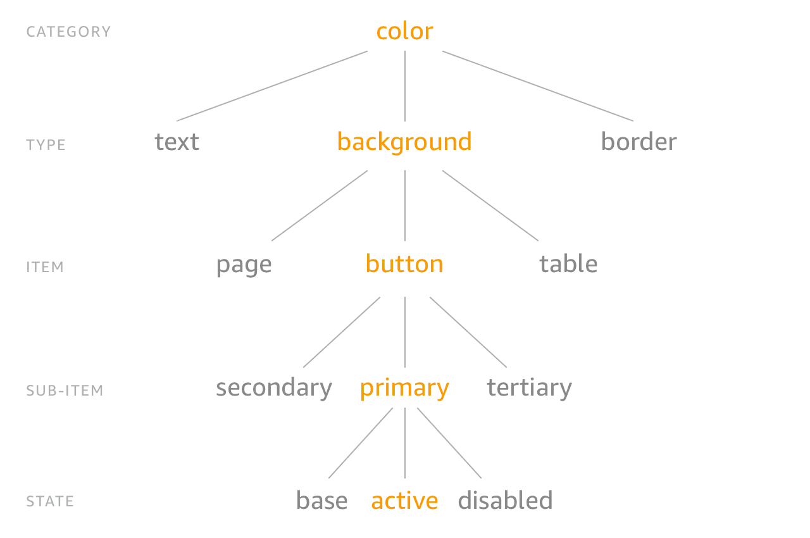

===================================
Paragon Design Tokens Compatibility
===================================

From version 23 `Paragon <https://github.com/openedx/paragon/>`_ supports CSS variables and 
`design tokens <https://tr.designtokens.org/format/#abstract>`_.

How to structure the brand design tokens files
==============================================

The file structure in the brand package should be the same as the version of Paragon used as a reference to allow the merge/override during the build time.
To see the tokens directory structure for the version of Paragon you are targeting, navigate to ``https://github.com/openedx/paragon/tree/TARGET_PARAGON_VERSION/tokens``.
For example, if you were working with Paragon v23.0.0 you would navigate to https://github.com/openedx/paragon/tree/v23.0.0/tokens.

.. code-block::
  
    paragon/
    └── tokens/
        └── src/
            ├── core/
            │   └── <name_of_the_folder>/
            │       └── <name_of_the_file>.json
            └── themes/
                ├── light/
                │   └── <name_of_the_folder>/
                │       └── <name_of_the_file>.json
                ├── dark/
                │   └── <name_of_the_folder>/
                │       └── <name_of_the_file>.json
                └── my-theme/
                    └── <name_of_the_folder>/
                        └── <name_of_the_file>.json

Once you have identified the token to override, you can replace ``<name_of_the_folder>`` and ``<name_of_the_file>`` with the right names.
Currently, Paragon is organized under **semantic tokens**, for a better understanding visit: 
`Design tokens implementation in Paragon <https://github.com/openedx/paragon/blob/master/docs/decisions/0019-scaling-styles-with-design-tokens.rst#design-tokens-implementation-in-paragon>`

Tokens format
=============

In terms of tokens, Paragon follows the specifications of the `Design Tokens Community Group <https://tr.designtokens.org/format/#abstract>`_, and
takes `style dictionary token structure <https://styledictionary.com/info/tokens/#category--type--item>`_ as inspiration:

With a subtle variation the structure to define most of the Paragon tokens is ``category > item > subitem > type > state``, for example:

.. code-block:: json
  
    {
      "spacing": {    // Category
        "$type": "dimension",                         
        "annotation": {    // Item 
          "padding": {     // Type
              "$value": ".5rem",
              "$source": "$annotation-padding"
          },
          "arrow-side": {   // Subitem
            "margin": {     // Type
              "$value": "{spacing.annotation.padding}",
              "$source": "$annotation-arrow-side-margin"
            }
          }
        }
      },
      "typography": {
        "annotation": {
          "font-size": { 
          "source": "$annotation-font-size", 
          "$value": "{typography.font.size.sm}", 
          "$type": "dimension" 
          },
        }
      },
    }

Each token has specific attributes:

- **Value**: It is the value that will be assigned to the variable, which could be a value or a reference, such as l arrow-side in the above example.
- **Type**: Indicates the property to be processed (color, dimension, etc..). This value could be defined for the token itself or a group of tokens (e.g. spacing)
- **Source**: This value is additional and indicates the equivalent in saas notation.
- **Modify**: Optional value that helps to apply a specific token modification.

Use the ``source`` attribute to map the tokens in Paragon and create the theme files. Also, it will help you to replace the values in scss files if you have custom variables (see below).

You can check `Paragon tokens <https://github.com/openedx/paragon/tree/alpha/tokens>`_ to know the folder and token structure, and how to work with modifiers.

Build the tokens and generate the CSS variables
===============================================

To build the tokens you can use Paragon CLI.

#. Install Paragon as a dev dependency

.. code-block:: bash
    
    npm ci

#. Once the tokens have been created. Go to the ``package.json``, there is a script template:

.. code-block:: json
    
    {
      "scripts": {
        "build-tokens": "paragon build-tokens --source ./tokens/ --build-dir  <destination_path>"
      }
    }
    
Replace the destination with the desired path and run the command, it is recommended to use ``./dist/``. 
You can check the CLI options `here <https://openedx.atlassian.net/wiki/spaces/BPL/pages/3770744958/Migrating+MFEs+to+Paragon+design+tokens+and+CSS+variables#Paragon-CLI-Documentation>`_

.. code-block:: bash
    
    npm run build-tokens

#. Publish the package. 

#. Once it is installed in the application use the Paragon CLI with the ``replace-variables`` command to use your custom tokens.

The ``theme-urls.json`` file
=============================

It is recommended to create the `theme-urls.json` if you are working with runtime theming and want to use ``ParagonWebpackPlugin`` to preload the token URLs during the application build time.

The file must be in the ``dist`` folder and should have:

.. code-block:: json
    
    {
		  "themeUrls": {
		    "defaults": {
		      "light": "light"
		    },
		    "variants": {
		      "light": {
		        "paths": {
		          "default": "./light.css",
		          "minified": "./light.min.css"
		        }
		      }
		      "my-theme": {
		        "paths": {
		          "default": "./my-theme.css",
		          "minified": "./my-theme.min.css"
		        }
		      }
		    },
		    "core": {
		      "paths": {
		        "default": "./core.css",
		        "minified": "./core.min.css"
		      }
		    }
		  }
		}

The paths must be relative to the ``theme-urls.json`` file and contain all the variants that you want to preload.