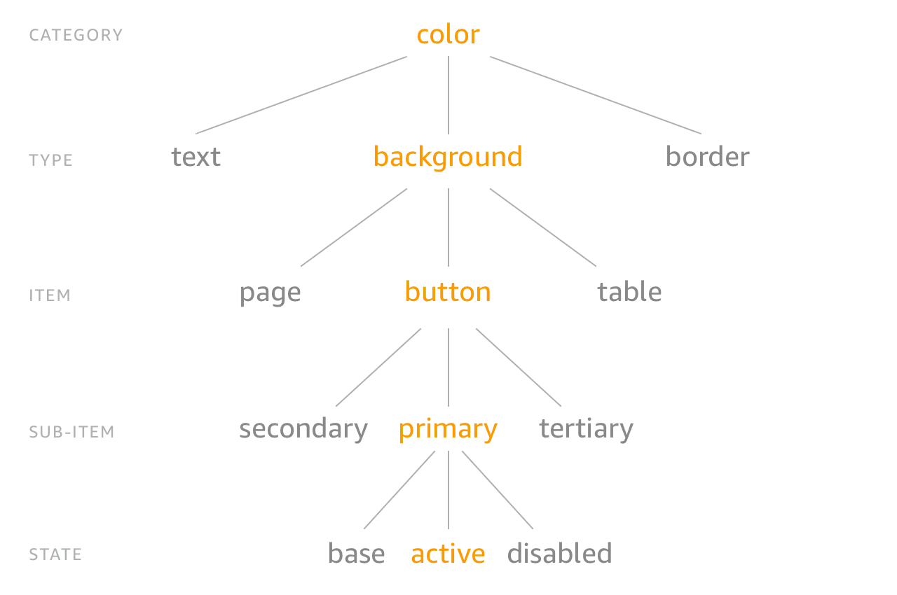

===================================
Paragon Design Tokens Compatibility
===================================

From version 23 `Paragon <https://github.com/openedx/paragon/>`_ supports CSS variables and 
`design tokens <https://tr.designtokens.org/format/#abstract>`_.

How to structure the brand design tokens files
==============================================

The file structure in the brand package should be the same as the version of Paragon used as a reference to allow the merge/override during the build time.
To see the tokens directory structure for the version of Paragon you are targeting, navigate to ``https://github.com/openedx/paragon/tree/TARGET_PARAGON_VERSION/tokens``.
For example, if you were working with Paragon v23.0.0 you would navigate to https://github.com/openedx/paragon/tree/v23.0.0/tokens.

.. code-block::
  
    paragon/
    └── tokens/
        └── src/
            ├── core/
            │   └── <name_of_the_folder>/
            │       └── <name_of_the_file>.json
            └── themes/
                ├── light/
                │   └── <name_of_the_folder>/
                │       └── <name_of_the_file>.json
                ├── dark/
                │   └── <name_of_the_folder>/
                │       └── <name_of_the_file>.json
                └── my-theme/
                    └── <name_of_the_folder>/
                        └── <name_of_the_file>.json

Once you have identified the token to override, you can replace ``<name_of_the_folder>`` and ``<name_of_the_file>`` with the right names.
Currently, Paragon is organized under **semantic tokens**, for a better understanding visit: 
`Design tokens implementation in Paragon <https://github.com/openedx/paragon/blob/master/docs/decisions/0019-scaling-styles-with-design-tokens.rst#design-tokens-implementation-in-paragon>`

Tokens format
=============

In terms of tokens, Paragon follows the specifications of the `Design Tokens Community Group <https://tr.designtokens.org/format/#abstract>`_, and
takes `style dictionary token structure <https://styledictionary.com/info/tokens/#category--type--item>`_ as inspiration:

With a subtle variation the structure to define most of the Paragon tokens is ``category > item > subitem > type > state``, for example:

.. code-block:: json
  
    {
      "spacing": {              // Category
        "$type": "dimension",
        "annotation": {         // Item 
          "padding": {          // Type
            "$value": ".5rem",
          },
          "arrow-side": {       // Subitem
            "margin": {         // Type
              "$value": "{spacing.annotation.padding}",
            }
          }
        }
      },
      "typography": {
        "annotation": {
          "font-size": {
            "$value": "{typography.font.size.sm}",
            "$type": "dimension"
          }
        }
      }
    }

Each token has specific attributes:

- **Value**: It is the value that will be assigned to the variable, which could be a value or a reference, such as arrow-side in the above example.
- **Type**: Indicates the property to be processed (color, dimension, etc.). This value could be defined for the token itself or a group of tokens (e.g. spacing)
- **Modify**: Optional value that helps to apply a specific token modification.

You can check `Paragon tokens <https://github.com/openedx/paragon/tree/release-23.x/tokens>`_ to know the folder and token structure, and how to work with modifiers.

Build the tokens and generate the CSS variables
===============================================

To build the tokens you can use Paragon CLI. You can check its options `here <https://github.com/openedx/paragon?tab=readme-ov-file#paragon-cli>`_. 
For using the help command run:

.. code-block:: bash
    
    npm run paragon:help -- <name of the command you want to see more information>

#. Install Paragon as a dev dependency

.. code-block:: bash
    
    npm ci

#. Once the tokens have been created. Go to the ``package.json``, there is a script template:

.. code-block:: json
    
    {
      "scripts": {
        "build-tokens": "paragon build-tokens --source ./tokens/ --build-dir  <destination_path> -t <theme_variant> -t <theme_variant>"
      }
    }
    
Replace the destination with the desired path and specify the theme variant to be compiled, then run the command. 
You can explore the command options using Paragon help for ``build-tokens``.

.. code-block:: bash
    
    npm run build-tokens

# Create the CSS distribution files modifying the template script in ``package.json``:

.. code-block:: json
    
    {
      "scripts": {
         "build-scss": "rm -rf dist && mkdir dist && paragon build-scss --corePath <core_scss_file> --themesPath <themes_css_files> --source",
      }
    }

Where ``<themes_css_files>`` is the path created when you run the build-tokens command and ``<core_scss_file>`` is the path to the scss core file, 
by default **./paragon/core.scss**. Then run the command:

.. code-block:: bash
    
    npm run build

You can explore the command options using Paragon help for ``build-scss``. Finally, this command should create 3 diffent files (.css, .map, .min.css) for the
core and each of the available themes; also, the command creates a ``theme-urls.json`` (see below for more details).

#. Publish the package. 

#. Once it is installed in the application use the Paragon CLI with the ``replace-variables`` command to use your custom tokens.
